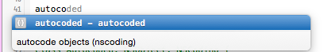
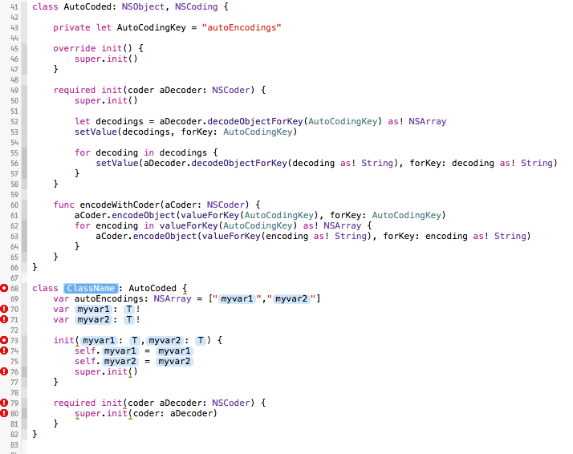

# AutoCoding
Easily have an object serialized and deserialized automatically in Swift

All you have to do is inherit from AutoCoded class and implement the autoEncodings var of the AutoCoding protocol to specify which plist/primitive properties you'd like to be auto encoded.

### Implementation Example

```
class Person: AutoCoded, AutoCoding {
    var autoEncodings: NSArray = ["name","age"]
    var name: String!
    var age: NSNumber!

    init(name: String,age: NSNumber) {
        self.name = name
        self.age = age
        super.init()
    }
    
    required init(coder aDecoder: NSCoder) {
        super.init(coder: aDecoder)
    }
}
```

### NSKeyedArchiver Example
```
var bob = Person()
bob.name = "Bob"
bob.age = 25

// Archive
let data = NSKeyedArchiver.archivedDataWithRootObject(bob)

// Unarchive
if let person = NSKeyedUnarchiver.unarchiveObjectWithData(data) as? Person {
    println(person.name)
}
```

### Xcode Snippet ###
The easiest way to use this is with the snippet found in my [SwiftXcodeSnippets](https://github.com/koreyhinton/SwiftXcodeSnippets).
Copy [C9BF586F-7D6D-4687-A10C-0C78A867B795.codesnippet](https://github.com/koreyhinton/SwiftXcodeSnippets/blob/master/C9BF586F-7D6D-4687-A10C-0C78A867B795.codesnippet) to ~/Library/Developer/Xcode/UserData/CodeSnippets/.




